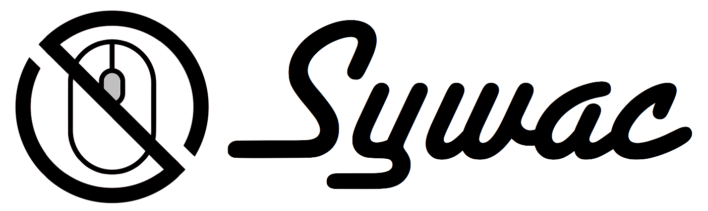

# 

> So you want a CLI...

[](https://travis-ci.org/sywac/sywac)
[](https://coveralls.io/github/sywac/sywac?branch=master)
[](https://standardjs.com)
[](https://greenkeeper.io/)

A better CLI framework, made for the ES2015 era.

**NOTE!** This project is still in prerelease - docs covering the full API will be available soon!

## Feature Highlights

- Single package install
- Asynchronous parsing, validation, and command execution
- Type-based argument parsing
- Plug in your own types or override/extend the built-in ones
- Support for simple CLIs or complex nested command trees
- First-class support for positional arguments, with or without commands
- Flexible auto-generated help content
- Support for ANSI styles/colors (we recommend [chalk](https://github.com/chalk/chalk))
- Define styles/colors inline or decorate content with style hooks
- Coherent API
- Parse strings as easily as `process.argv`
- Supports concurrent parsing, safe for chatbots or other server-side apps

## Installation

```console
$ npm install --save sywac
```

## License

MIT
